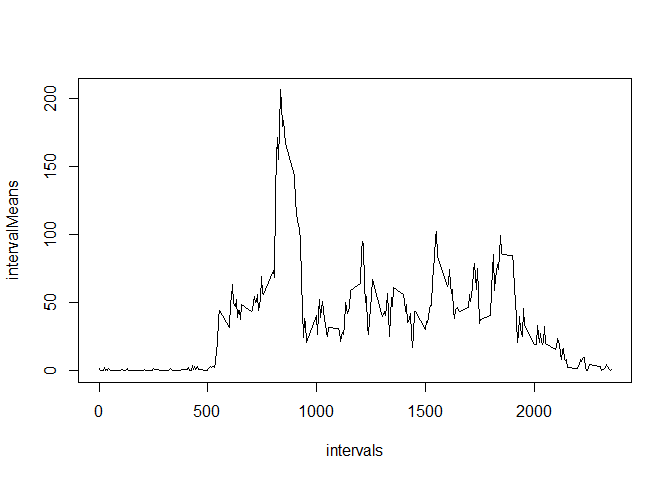
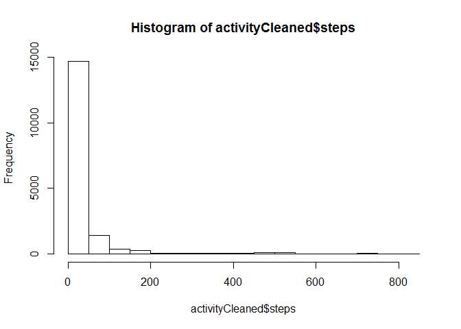

# Reproducible Search - Week 2 Assignment
Alexander Klar  
11 September 2016  


## Preface

In this assignment we will download an Activity Monitoring Data Set and perform some analysis on it. The variables included in this dataset are:

    steps: Number of steps taking in a 5-minute interval (missing values are coded as NA)
    date: The date on which the measurement was taken in YYYY-MM-DD format
    interval: Identifier for the 5-minute interval in which measurement was taken

The dataset is stored in a comma-separated-value (CSV) file and there are a total of 17,568 observations in this dataset.

Here are the steps:

### 1. Download and preprocess the data:

Download and extract zip file:

```r
zipFile <- "activity.zip"
zipURL <- "https://github.com/alklar/RepData_PeerAssessment1/raw/master/activity.zip"
download.file(zipURL, destfile= zipFile)
unzip(zipFile)
```

Read in unzipped csv file to activityRaw, 
remove missing values and store the result in activity:

```r
activityRaw <- read.csv("activity.csv", header = TRUE, na.strings = "NA")
activity <- activityRaw[!is.na(activityRaw$steps),]
```

### 2. Histogram of the total number of steps taken each day:

At first we need to calculate the total number of steps taken per day:

```r
stepsPerDay <- tapply(activity$steps, activity$date, sum)
hist(stepsPerDay)
```

<!-- -->

### 3. Calculate and report the mean and median of the total number of steps taken per day

```r
meanSteps <- mean(stepsPerDay, na.rm = TRUE)
meanSteps
```

```
## [1] 10766.19
```

```r
medianSteps <- median(stepsPerDay, na.rm = TRUE)
medianSteps
```

```
## [1] 10765
```


### 4. What is the average daily activity pattern?
Make a time series plot of the 5-minute interval (x-axis) and the average number of steps taken, averaged across all days (y-axis):

```r
intervalMeans <- tapply(activity$steps, activity$interval, mean)
intervals <- unique(activity$interval)
plot(intervals, intervalMeans, type = "l")
```

<!-- -->

### 5. Which 5-minute interval, on average across all the days in the dataset, contains the maximum number of steps?
Create a dataframe from intervals and intervalMeans, 
select the maximum value from the means and look up the corresponding interval:

```r
intervalDF <- data.frame(intervals, intervalMeans)
maxVal <- max(intervalMeans)
maxInterval <- intervalDF$intervals[intervalMeans == maxVal]
maxInterval
```

```
## [1] 835
```

Interval 835 contains the maximum average number of steps (206.1698113). 

### 6. Imputing missing values
We start by calculating the total number of missing values in the dataset:

```r
sum(is.na(activityRaw$steps))
```

```
## [1] 2304
```

My strategy for filling in all of the missing values in the dataset:
I will use the mean for the 5-minute intervals calculated in step 4.
From the raw data activityRaw I create new dataset activityCleaned, that is equal to the original dataset. Then I loop over all rows and replace missing values for the steps column by the mean for that interval:

```r
activityCleaned <- activityRaw
totalRows <- as.numeric(nrow(activityCleaned))
for(i in 1:totalRows){
  if(is.na(activityCleaned$steps[i])){
    activityCleaned$steps[i] <- intervalDF$intervalMeans[intervalDF$intervals == activityCleaned$interval[i]]
  }
}
```

### 7. Make a histogram of the total number of steps taken each day: 

```r
hist(activityCleaned$steps)
```

<!-- -->

### 8. Panel plot comparing the average number of steps taken per 5-minute interval across weekdays and weekends:

Therefore we create a factor weekday with two levels, 'Weekend' and 'Weekday':

```r
weekdays <- c("Montag", "Dienstag", "Mittwoch", "Donnerstag", "Freitag")
activityCleaned$weekday <- factor((weekdays(as.Date(activityCleaned$date)) %in% weekdays), 
                   levels=c(FALSE, TRUE), labels=c('Weekend', 'Weekday')) 
```
As you saw I have a German locale. In your environment change the values accordingly.

We now use the dplyr package to calculate the average steps per interval across weekdays and weekends:

```r
library(dplyr)
```

```
## 
## Attaching package: 'dplyr'
```

```
## The following objects are masked from 'package:stats':
## 
##     filter, lag
```

```
## The following objects are masked from 'package:base':
## 
##     intersect, setdiff, setequal, union
```

```r
intervalWDMeans <- activityCleaned %>% group_by(interval, weekday)  %>% 
  summarize(aggrSteps = mean(steps))
```

Now we are ready to make 2x1 panel plot using the base plotting system:

```r
par(mfcol = c(2, 1))
with(intervalWDMeans[intervalWDMeans$weekday == "Weekday", ], 
     plot(interval, aggrSteps, type = "l", xlab = "Interval", ylab = "Number of Steps",
          main = "Weekday"))
with(intervalWDMeans[intervalWDMeans$weekday == "Weekend", ], 
     plot(interval, aggrSteps, type = "l", xlab = "Interval", ylab = "Number of Steps",
          main = "Weekend"))
```

<!-- -->

The plot shows, that the maximum average steps are higher during weekdays. 
